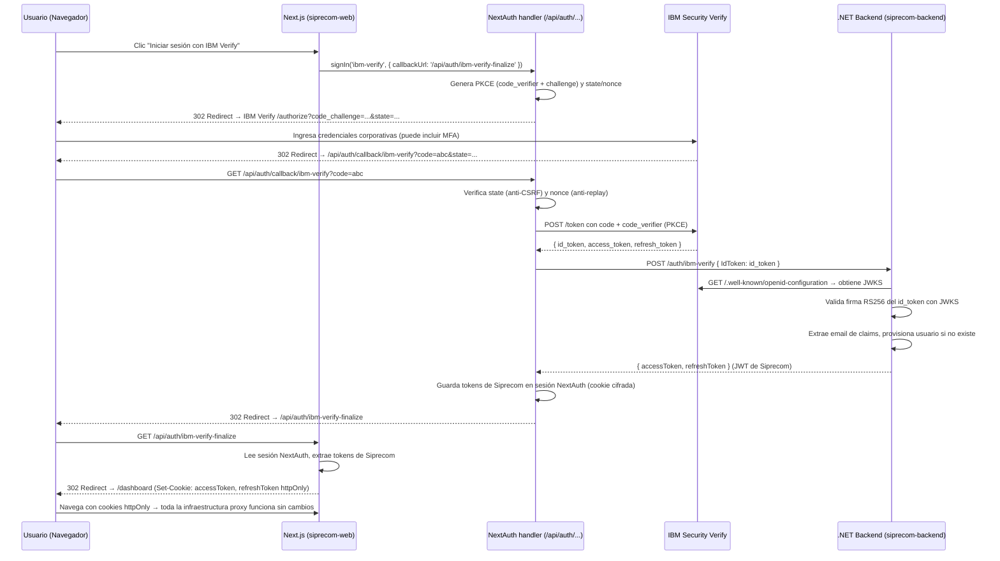

# IBM Security Verify — Federación de Identidad en Siprecom

## Índice

1. [¿Qué es IBM Security Verify?](#1-qué-es-ibm-security-verify)
2. [Por qué adoptar IBM Verify en Siprecom](#2-por-qué-adoptar-ibm-verify-en-siprecom)
3. [Arquitectura de la integración](#3-arquitectura-de-la-integración)
4. [Flujo de autenticación completo](#4-flujo-de-autenticación-completo)
5. [Configuración en la consola IBM Verify](#5-configuración-en-la-consola-ibm-verify)
6. [Variables de entorno](#6-variables-de-entorno)
7. [Archivos modificados / creados](#7-archivos-modificados--creados)
8. [Cómo funciona cada pieza](#8-cómo-funciona-cada-pieza)
9. [Seguridad: comparación con el sistema anterior](#9-seguridad-comparación-con-el-sistema-anterior)
10. [Pruebas end-to-end](#10-pruebas-end-to-end)
11. [Despliegue en producción](#11-despliegue-en-producción)
12. [Troubleshooting](#12-troubleshooting)

---

## 1. ¿Qué es IBM Security Verify?

IBM Security Verify (anteriormente IBM Cloud Identity) es un **Identity Provider (IdP) empresarial SaaS** que implementa los estándares OpenID Connect (OIDC) y SAML 2.0. Actúa como el único punto donde los usuarios se autentican; las aplicaciones confían en los tokens que emite.

Capacidades clave:
- Federación con directorios corporativos (Active Directory, LDAP, SCIM)
- MFA integrado: push notifications, TOTP, hardware keys
- SSO (Single Sign-On) entre múltiples aplicaciones
- Políticas de acceso condicional
- Auditoría centralizada de todos los eventos de autenticación
- Ciclo de vida de usuarios: provisioning y deprovisioning automáticos

---

## 2. Por qué adoptar IBM Verify en Siprecom

### Estado previo — limitaciones

| Aspecto | Problema |
|---|---|
| **JWTs auto-emitidos** | El backend firmaba con clave simétrica HMAC-SHA256. Si la `Jwt:Key` se filtrase, cualquiera podría forjar tokens de administrador. |
| **Contraseñas en la DB** | ASP.NET Identity gestiona el hash de contraseñas. Responsabilidad de actualizaciones de seguridad, flujo de reset, bloqueos, etc. |
| **IdPs fragmentados** | Microsoft, Google y email/password con lógica separada. Actualizar uno implica cambios de código. |
| **Sin MFA unificado** | Los usuarios de email/password no tenían segundo factor. |
| **Deprovisioning manual** | Dar de baja un empleado requería acción en la DB de Siprecom; ventana de acceso indebido. |
| **Sin SSO entre apps** | Cada app del ecosistema (siprecom, admin, novedades, etc.) implementa su propio auth. |

### Con IBM Verify — mejoras

| Aspecto | Mejora |
|---|---|
| **Firma asimétrica (RS256/ES256)** | IBM Verify firma con su clave privada; el backend valida con la clave pública del JWKS. La clave privada **nunca sale del IdP**. |
| **Sin contraseñas en Siprecom** | Los usuarios de IBM Verify se autentican exclusivamente en el IdP corporativo. |
| **MFA out-of-the-box** | Cualquier política MFA configurada en IBM Verify aplica automáticamente a todos los usuarios, sin cambios en Siprecom. |
| **Deprovisioning automático** | Desactivar un usuario en el directorio corporativo (AD/LDAP) revoca el acceso a Siprecom en el siguiente login. |
| **PKCE obligatorio** | Protección contra interceptación del authorization code. |
| **Auditoría centralizada** | IBM Verify registra todos los eventos para compliance. |

---

## 3. Arquitectura de la integración

```
┌───────────────────┐    OIDC (Authorization Code + PKCE)    ┌─────────────────────┐
│                   │ ──────────────────────────────────────> │                     │
│  siprecom-web     │                                         │  IBM Security Verify │
│  (Next.js 16)     │ <────────────────────────────────────── │  (IdP SaaS)         │
│                   │          id_token + access_token        │                     │
└────────┬──────────┘                                         └─────────────────────┘
         │                                                           ▲
         │ POST /auth/ibm-verify                                     │
         │ { IdToken: "..." }          Valida firma con JWKS ────────┘
         ▼
┌───────────────────┐
│  siprecom-backend │  → Provisiona usuario si no existe
│  (.NET 8)         │  → Emite JWT interno de Siprecom
└───────────────────┘
```

**Responsabilidades:**

| Componente | Rol |
|---|---|
| **IBM Verify** | Autentica al usuario, emite `id_token` firmado con RS256/ES256 |
| **NextAuth.js** (siprecom-web) | Maneja el flujo OIDC en el servidor (redirect, PKCE, code exchange, callbacks) |
| **`/api/auth/ibm-verify-finalize`** | Extrae tokens de la sesión NextAuth y los pone en cookies httpOnly compatibles con la infraestructura existente |
| **siprecom-backend** | Valida el `id_token` contra el JWKS de IBM Verify, provisiona usuario, emite JWT de Siprecom |

---

## 4. Flujo de autenticación completo



---

## 5. Configuración en la consola IBM Verify

### Paso 1: Crear la aplicación OIDC

1. Ir a **Applications > Applications > Add application**
2. Seleccionar **Custom Application**
3. En la pestaña **Sign-on**, seleccionar **OpenID Connect 1.0**

### Paso 2: Parámetros obligatorios

| Campo | Valor |
|---|---|
| **Application URL** | `https://app.siprecom.com` (URL de la app) |
| **Redirect URIs** | `https://app.siprecom.com/api/auth/callback/ibm-verify` (producción) y `http://localhost:3000/api/auth/callback/ibm-verify` (desarrollo) |
| **Grant types** | ✅ Authorization Code (marcar PKCE) |
| **Client authentication** | Client Secret |
| **Scopes** | `openid`, `profile`, `email` |

### Paso 3: Attribute mappings (claims)

Configurar en IBM Verify que el ID token incluya:

| Claim | Fuente del directorio |
|---|---|
| `email` | Email del usuario (obligatorio para el provisioning) |
| `given_name` | Nombre (opcional, para el perfil) |
| `family_name` | Apellido (opcional) |
| `picture` | URL de foto de perfil (opcional) |
| `roles` | Grupos o roles del directorio (opcional, para RBAC automático) |

> **Importante**: el claim `email` es obligatorio. Sin él, el backend rechaza el login.

### Paso 4: Fuentes de identidad

En la sección **Access**, conectar la fuente de identidad corporativa (Active Directory, LDAP, o Verify Cloud Directory según el entorno).

### Paso 5: Anotar los valores

Una vez guardada la aplicación, anotar:
- **Issuer URL**: `https://<tenant>.verify.ibm.com/oidc/endpoint/default`
- **Client ID**: identificador de la app (no secreto)
- **Client Secret**: secreto del cliente (guardar en variables de entorno, **nunca en código**)

---

## 6. Variables de entorno

### siprecom-web (`.env.local`)

```env
# Habilita el botón de IBM Verify en la pantalla de login
NEXT_PUBLIC_IBM_VERIFY_ENABLED=true

# Issuer URL del tenant de IBM Verify (también usado como Authority)
IBM_VERIFY_ISSUER=https://your-tenant.verify.ibm.com/oidc/endpoint/default

# Client ID de la aplicación OIDC en IBM Verify
IBM_VERIFY_CLIENT_ID=your-client-id

# Client Secret (SECRETO — nunca exponer al cliente)
IBM_VERIFY_CLIENT_SECRET=your-client-secret

# Clave para cifrar sesiones de NextAuth
# Generar con: openssl rand -base64 32
NEXTAUTH_SECRET=your-secret-here

# URL base de la app (Next.js la necesita para construir callbacks)
NEXTAUTH_URL=https://app.siprecom.com
```

### siprecom-backend (`appsettings.json` / variables de entorno)

```json
{
  "IbmVerify": {
    "Authority": "https://your-tenant.verify.ibm.com/oidc/endpoint/default",
    "ClientId": "your-client-id"
  }
}
```

> El backend **no necesita el ClientSecret** porque solo valida el `id_token` con la clave pública del JWKS (descargada automáticamente del discovery document). El ClientSecret solo lo usa NextAuth para el intercambio de tokens.

---

## 7. Archivos modificados / creados

### siprecom-web (Next.js)

| Archivo | Estado | Descripción |
|---|---|---|
| `lib/ibm-verify-auth.ts` | **Nuevo** | Configuración de NextAuth con el proveedor IBM Verify. Callbacks JWT y session. Lógica de intercambio de tokens con el backend. |
| `app/api/auth/[...nextauth]/route.ts` | **Nuevo** | Handler de NextAuth para App Router. Exporta GET y POST. |
| `app/api/auth/ibm-verify-finalize/route.ts` | **Nuevo** | Puente entre la sesión NextAuth y las cookies httpOnly que usa `backend-fetch.ts`. |
| `types/next-auth.d.ts` | **Nuevo** | Augmentaciones de tipos para `JWT` y `Session` de NextAuth. |
| `app/(auth)/login/page.tsx` | **Modificado** | Agregado botón "Iniciar sesión con IBM Verify" (visible solo si `NEXT_PUBLIC_IBM_VERIFY_ENABLED=true`). |
| `proxy.ts` | **Modificado** | Agregado bypass explícito para rutas `/api/auth/*` (callbacks de NextAuth). |
| `.env.local` | **Modificado** | Agregadas variables de IBM Verify con documentación. |

### siprecom-backend (.NET)

| Archivo | Estado | Descripción |
|---|---|---|
| `Core/DTOs/Auth/IbmVerifyLoginDTO.cs` | **Nuevo** | DTO para el endpoint `/auth/ibm-verify`. Recibe el `id_token` de IBM Verify. |
| `Controllers/AuthController.cs` | **Modificado** | Nuevo endpoint `POST /auth/ibm-verify`. Valida el `id_token`, provisiona usuario, emite JWT de Siprecom. |
| `appsettings.json` | **Modificado** | Sección `IbmVerify` con `Authority` y `ClientId`. |
| `appsettings.Example.json` | **Modificado** | Mismo, con valores de ejemplo y documentación. |

---

## 8. Cómo funciona cada pieza

### `lib/ibm-verify-auth.ts` — Configuración NextAuth

Define el proveedor OIDC de IBM Verify con:
- **PKCE** habilitado (`checks: ["pkce", "state", "nonce"]`)
- **Intercambio de tokens** en el callback `jwt`: llama a `/auth/ibm-verify` del backend con el `id_token` de IBM Verify y guarda los tokens de Siprecom en el JWT de NextAuth (cookie cifrada httpOnly)
- **Sesión JWT** (stateless): no requiere base de datos de sesiones

### `app/api/auth/[...nextauth]/route.ts` — Handler de NextAuth

Punto de entrada para todos los endpoints de NextAuth:
- `GET /api/auth/callback/ibm-verify` → procesa el callback OIDC, intercambia el code por tokens
- `GET /api/auth/signin/ibm-verify` → inicia el flujo de login
- `POST /api/auth/signout` → cierra la sesión NextAuth

### `app/api/auth/ibm-verify-finalize/route.ts` — Puente de cookies

Después de que NextAuth completa el flujo OIDC:
1. Lee el JWT de NextAuth de la cookie (con `getToken()`)
2. Extrae los tokens de Siprecom (`siprecomAccessToken`, `siprecomRefreshToken`)
3. Los setea como cookies `accessToken` y `refreshToken` (httpOnly, Secure, SameSite=Lax)
4. Redirige al dashboard

Esto hace que toda la infraestructura de proxy existente (`backend-fetch.ts`) funcione sin cambios: los usuarios de IBM Verify son indistinguibles de los usuarios de Microsoft o email/password una vez que tienen las cookies httpOnly.

### `Controllers/AuthController.cs` — Endpoint backend IBM Verify

El endpoint `POST /auth/ibm-verify`:

1. Recibe `{ IdToken: "..." }` del frontend
2. Descarga el discovery document de IBM Verify desde `<Authority>/.well-known/openid-configuration`
3. Obtiene el JWKS (claves públicas de firma) del discovery document
4. Valida el `id_token`:
   - Firma criptográfica (RS256/ES256) contra el JWKS
   - Issuer (`iss` == Authority configurado)
   - Audience (`aud` == ClientId configurado)
   - Expiración (`exp`)
5. Extrae el email del claim `email`
6. Si el usuario no existe: crea `ApplicationUser` sin contraseña (solo puede autenticarse via IBM Verify)
7. Actualiza nombre/apellido/foto si cambiaron
8. Retorna `TokenDTO` (JWT de Siprecom)

---

## 9. Seguridad: comparación con el sistema anterior

### Firma de tokens

| | Antes | Con IBM Verify |
|---|---|---|
| **Algoritmo** | HMAC-SHA256 (simétrico) | RS256 o ES256 (asimétrico) |
| **Clave** | `Jwt:Key` compartida entre firmante y validador | Clave privada solo en IBM Verify; clave pública en JWKS público |
| **Impacto de una fuga** | Cualquiera puede forjar tokens admin | Nadie puede forjar tokens (la clave privada está en IBM Verify) |

### PKCE (Proof Key for Code Exchange)

El flujo OIDC usa PKCE obligatoriamente:
1. Al iniciar el login, NextAuth genera un `code_verifier` aleatorio (secuencia de bytes con alta entropía)
2. Calcula `code_challenge = SHA256(code_verifier)` y lo envía a IBM Verify
3. IBM Verify almacena el `code_challenge`
4. Al intercambiar el `code` por tokens, NextAuth envía el `code_verifier` original
5. IBM Verify verifica `SHA256(code_verifier) == code_challenge` antes de emitir tokens

**Si el `authorization code` es interceptado** (ej. en un log de acceso, redirect attack), el atacante no puede usarlo sin el `code_verifier` que solo conoce el cliente legítimo.

### Cookie security

Las cookies de autenticación son:
- `httpOnly`: no accesibles desde JavaScript (mitiga XSS)
- `Secure`: solo se envían por HTTPS en producción
- `SameSite=Lax`: no se envían en requests cross-site de terceros (mitiga CSRF)

### Rate limiting

El endpoint `POST /auth/ibm-verify` está protegido por el `AuthPolicy` de rate limiting (10 requests/minuto por IP), igual que los demás endpoints de autenticación.

---

## 10. Pruebas end-to-end

### Checklist de pruebas

1. **Login básico**
   - [ ] Clic en "Iniciar sesión con IBM Verify" → redirige a IBM Verify
   - [ ] Login en IBM Verify → redirige de vuelta a Siprecom
   - [ ] Dashboard carga correctamente
   - [ ] Cookie `accessToken` presente en DevTools > Application > Cookies (debe ser httpOnly)

2. **Claims y provisioning**
   - [ ] Primera vez: el usuario se crea en la DB de Siprecom (verificar en `/auth/users`)
   - [ ] Segunda vez: el usuario existente es encontrado, no se duplica
   - [ ] El campo email en la sesión coincide con el del directorio corporativo

3. **Acceso a recursos protegidos**
   - [ ] Una llamada API (ej. GET `/api/proyectos`) devuelve 200
   - [ ] Sin cookies: GET `/api/proyectos` devuelve 401

4. **Expiración y refresh**
   - [ ] Esperar hasta que expire el accessToken (1 hora)
   - [ ] La próxima llamada API debe renovar automáticamente via `/api/auth/refresh`
   - [ ] El usuario no necesita re-autenticarse

5. **Logout**
   - [ ] Logout → cookies eliminadas
   - [ ] Intentar acceder al dashboard → redirige al login

6. **Modo de prueba IBM Verify**
   - Agregar `?test=true` a la URL de login de IBM Verify para ver los claims que emite sin completar el flujo real
   - Verificar que `email`, `given_name`, `family_name` están presentes

7. **Compatibilidad con login existente**
   - [ ] Login con email/password sigue funcionando
   - [ ] Login con Microsoft sigue funcionando
   - [ ] No hay regresiones en el flujo de refresh

### Activar logs de diagnóstico en desarrollo (.NET)

En `appsettings.Development.json`:
```json
{
  "Logging": {
    "LogLevel": {
      "Microsoft.IdentityModel": "Debug",
      "Microsoft.AspNetCore.Authentication": "Debug"
    }
  }
}
```

---

## 11. Despliegue en producción

### Variables de entorno obligatorias

```bash
# Backend (Azure App Service / variables de entorno)
IbmVerify__Authority=https://your-tenant.verify.ibm.com/oidc/endpoint/default
IbmVerify__ClientId=your-client-id

# Frontend (Vercel / Azure Static Web Apps)
IBM_VERIFY_ISSUER=https://your-tenant.verify.ibm.com/oidc/endpoint/default
IBM_VERIFY_CLIENT_ID=your-client-id
IBM_VERIFY_CLIENT_SECRET=your-client-secret   # SECRETO
NEXTAUTH_SECRET=your-nextauth-secret           # SECRETO — openssl rand -base64 32
NEXTAUTH_URL=https://app.siprecom.com
NEXT_PUBLIC_IBM_VERIFY_ENABLED=true
```

### Redirect URIs en IBM Verify

Registrar **ambas** URIs en la consola de IBM Verify:
- `https://app.siprecom.com/api/auth/callback/ibm-verify` (producción)
- `https://test.siprecom.com/api/auth/callback/ibm-verify` (test)
- `http://localhost:3000/api/auth/callback/ibm-verify` (desarrollo, si se usa)

### Balanceo de carga

Si el backend .NET corre en múltiples instancias, configurar **DataProtection** con almacenamiento compartido (Azure Key Vault + Azure Blob Storage) para que las cookies de sesión sean válidas en cualquier instancia:

```csharp
// Program.cs (ejemplo con Azure)
builder.Services.AddDataProtection()
    .PersistKeysToAzureBlobStorage(connectionString, containerName, "keys.xml")
    .ProtectKeysWithAzureKeyVault(keyIdentifier, credential);
```

---

## 12. Troubleshooting

### Error: "El id_token de IBM Verify no es válido"

Causas comunes:
- **Clock skew**: verificar que el servidor .NET tenga la hora sincronizada (NTP). La tolerancia configurada es de 5 minutos.
- **Audience incorrecta**: verificar que `IbmVerify:ClientId` en `appsettings.json` coincida exactamente con el Client ID de IBM Verify.
- **Issuer incorrecto**: verificar que `IbmVerify:Authority` coincida con el campo `iss` del id_token (decodificar en jwt.io).

### Error: "IBM Verify no está configurado en este entorno"

`IbmVerify:Authority` está vacío en `appsettings.json`. Completar el valor o configurar la variable de entorno `IbmVerify__Authority`.

### Error: "El id_token no incluye el claim 'email'"

En la consola de IBM Verify, ir a la aplicación OIDC → **Attribute Mappings** → agregar el mapping de `email` al ID token.

### `signIn('ibm-verify')` redirige al login con `?error=...`

El intercambio de tokens falló (callback `jwt` retornó error). Revisar:
1. Que el backend esté corriendo y accesible desde el servidor de Next.js
2. Que `NEXT_PUBLIC_API_URL` apunte al backend correcto
3. Los logs del backend para ver el error específico

### Botón de IBM Verify no aparece en el login

Verificar que `NEXT_PUBLIC_IBM_VERIFY_ENABLED=true` esté seteado. Esta variable es pública (prefijo `NEXT_PUBLIC_`) por lo que Next.js la incluye en el bundle del cliente.

---

## Referencias

- [IBM Security Verify Documentation — OIDC](https://docs.verify.ibm.com/verify/docs/oidc-applications)
- [NextAuth.js v4 — Custom OIDC Providers](https://next-auth.js.org/configuration/providers/oauth)
- [RFC 7636 — PKCE](https://datatracker.ietf.org/doc/html/rfc7636)
- [OpenID Connect Core 1.0](https://openid.net/specs/openid-connect-core-1_0.html)
- [ASP.NET Core — JWT Bearer Authentication](https://docs.microsoft.com/en-us/aspnet/core/security/authentication/jwt-authn)
